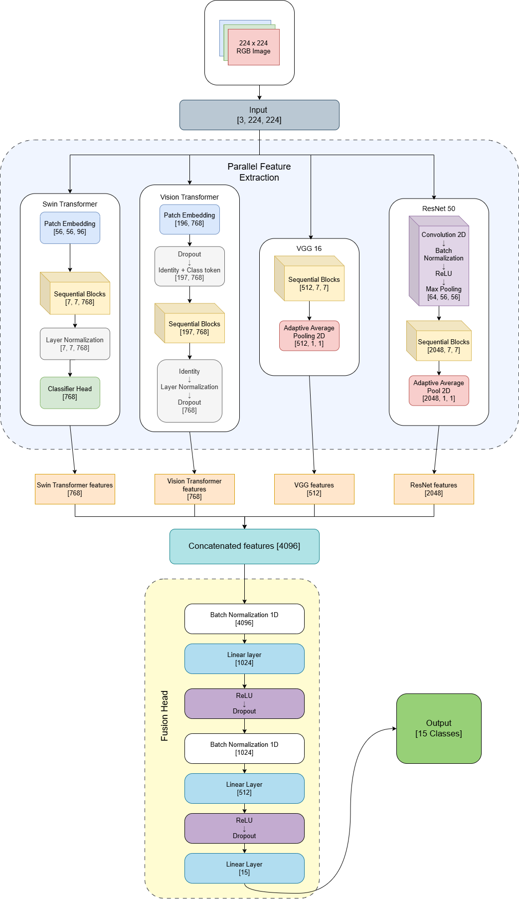

# HaritaX: A Hybrid Deep Learning Ensemble for Intelligent Plant Disease Detection

[](https://opensource.org/licenses/MIT)
[](https://www.python.org/downloads/)
[](https://tensorflow.org/)
[](https://pytorch.org/)

> **Leveraging Multi-Architecture Learning for Accurate and Scalable Crop Disease Classification**

HaritaX is a state-of-the-art hybrid deep learning ensemble that combines the strengths of Convolutional Neural Networks (CNNs) and Vision Transformers (ViTs) for intelligent plant disease detection. By fusing feature representations from multiple architectures, HaritaX achieves exceptional accuracy and robustness for real-world agricultural applications.

## 🌟 Key Features

- **Hybrid Architecture**: Combines VGG16, ResNet50, Vision Transformer (ViT), and Swin Transformer
- **Feature-Level Fusion**: Advanced ensemble technique for superior performance
- **State-of-the-Art Results**: 99.76% test accuracy on PlantVillage dataset
- **Real-World Ready**: Robust against lighting variations, complex backgrounds, and occlusions
- **Scalable Design**: Suitable for deployment in precision agriculture systems
  
## 🧠 HaritaX Ensemble Architecture

HaritaX combines the best of both worlds — **CNNs** (for local feature extraction) and **Transformers** (for global context) using **feature-level fusion**.

### 🔧 Architecture Components:
- **VGG16** (512-d features)
- **ResNet50** (2048-d features)
- **ViT (Vision Transformer)** (768-d features)
- **Swin Transformer** (768-d features)

These feature vectors are **concatenated** to form a single 4096-dimensional vector which is passed through a **custom MLP fusion head** for final classification into 15 plant disease classes.

### 📊 Fusion Head:
- Linear (4096 → 1024) + ReLU + Dropout
- Linear (1024 → 512) + ReLU + Dropout
- Linear (512 → 15 classes) + Softmax

---

### 📸 Architecture Diagram



> *Diagram showing VGG16, ResNet50, ViT, and Swin feeding into a concatenation block, then into an MLP head.*

---

📌 This ensemble design enables the model to learn:
- **Local textures** (from CNNs)
- **Global spatial relationships** (from Transformers)
- **Synergistic features** through fusion, boosting generalization and performance.


## 📊 Performance Metrics

| Metric | Score |
|--------|-------|
| Test Accuracy | 99.76% |
| Precision | 99.74% |
| Recall | 99.77% |
| F1-Score | 99.76% |

## 🚀 Quick Start

### Prerequisites

```
Python 3.8+
TensorFlow 2.x
PyTorch 1.x
timm
numpy
matplotlib
scikit-learn
```

### Installation

1. **Clone the repository**
```
git clone https://github.com/aayush010904/HaritaX.git
cd haritax
```

2. **Install dependencies**
```
pip install -r requirements.txt
```

3. **Download the dataset**
```
import kagglehub

# Download latest version
path = kagglehub.dataset_download("emmarex/plantdisease")

print("Path to dataset files:", path)
```

### Usage
### Training Individual Models

#### Training the Ensemble


#### Inference


## 📁 Project Structure

```
HaritaX/
├── notebooks/
│ ├── Ensemble_CNN_transformer.ipynb # Final ensemble model
│ ├── FullDataset_VGG16.ipynb # VGG16 training on full dataset
│ ├── ResNet50_Final.ipynb # ResNet50 model
│ ├── SWIN_transformers.ipynb # Swin Transformer model
│ └── VIT_pytorch.ipynb # Vision Transformer implementation
├── README.md
├── LICENSE
├── CONTRIBUTING.md
└── requirements.txt
```

## 🔬 Dataset

The project uses the **PlantVillage dataset** containing 20,638 images across 15 classes:

- **Bell Pepper**: Bacterial Spot, Healthy
- **Potato**: Early Blight, Late Blight, Healthy  
- **Tomato**: 10 different disease classes + Healthy

## 🧪 Experimental Results

| Model | Test Accuracy | Precision | Recall | F1-Score |
|-------|---------------|-----------|--------|----------|
| VGG16 | 96.53% | 95.41% | 95.55% | 95.77% |
| ResNet50 | 98.99% | 98.45% | 98.57% | 98.51% |
| Swin Transformer | 98.80% | 98.65% | 98.70% | 98.67% |
| ViT-Base | 98.45% | 98.20% | 98.35% | 98.27% |
| **HaritaX (Ensemble)** | **99.76%** | **99.74%** | **99.77%** | **99.76%** |

## 🤝 Contributing

We welcome contributions! Please see our [Contributing Guidelines](CONTRIBUTING.md) for details.

## 📄 License

This project is licensed under the MIT License - see the [LICENSE](LICENSE) file for details.

## 👥 Authors

- **Aayush Chauhan** 
- **Ekansh Dubey**  
- **Manish Sharma** 


**Made with ❤️ for sustainable agriculture and food security**


